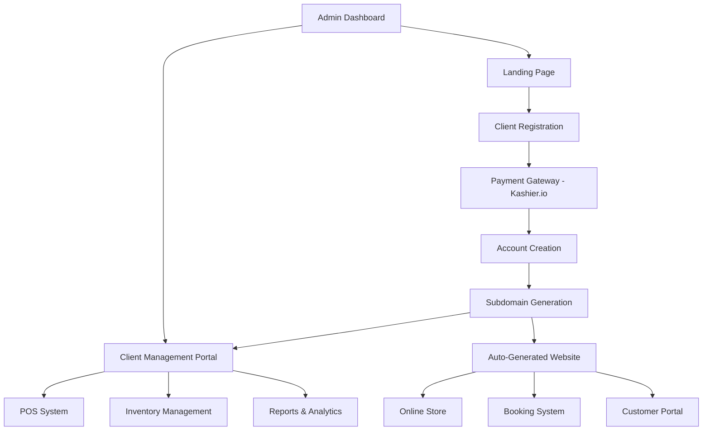

# FlokiPOS - Complete Technical Documentation & Project Organization

## 📋 Table of Contents

1. [System Architecture Overview](#1-system-architecture-overview)
2. [Landing Page System](#2-landing-page-system)
3. [Client Branded Website Generator](#3-client-branded-website-generator)
4. [Management System & POS Portal](#4-management-system--pos-portal)
5. [Company Admin Dashboard](#5-company-admin-dashboard)
6. [Database Schema & API Specifications](#6-database-schema--api-specifications)
7. [File Structure & Organization](#7-file-structure--organization)
8. [Technical Implementation Guidelines](#8-technical-implementation-guidelines)

---

## 1. System Architecture Overview

### 1.1 High-Level Architecture



### 1.2 System Components

| Component | Technology | Purpose |
|-----------|------------|---------|
| Landing Page | React + Tailwind | Client acquisition & registration |
| Admin Dashboard | React + Charts | System management & analytics |
| Client Portal | React + POS Interface | Business management & POS |
| Website Generator | React + Dynamic Routing | Client branded websites |
| API Backend | Node.js + Express | All business logic & data |
| Database | SQLite + Knex | Data persistence |
| Payment | Kashier.io API | Payment processing |
| File Storage | Local/Cloud Storage | Images & documents |

---

## 2. Landing Page System

### 2.1 Page Structure & Components

#### 2.1.1 Navigation Component
```
Location: /frontend/src/components/landing/Navigation.jsx
Features:
- Fixed header with logo
- Navigation menu (Features, Pricing, About, Contact)
- Login/Register buttons
- Mobile responsive hamburger menu
- Smooth scroll to sections
```

#### 2.1.2 Hero Section
```
Location: /frontend/src/components/landing/Hero.jsx
Content:
- Main headline with value proposition
- Subtext describing key benefits
- CTA buttons (Start Free Trial, Watch Demo)
- Hero image/video
- Social proof elements (customer count, ratings)
```

#### 2.1.3 Features Section
```
Location: /frontend/src/components/landing/Features.jsx
Features to highlight:
- POS System with inventory
- Customer Management
- Staff Management
- Reports & Analytics
- Branded Website Generation
- Booking System
- Multi-payment support
- Cloud-based security

Layout: 3-column grid on desktop, 1-column on mobile
Each feature: Icon + Title + Description + Learn More link
```

#### 2.1.4 Pricing Section
```
Location: /frontend/src/components/landing/Pricing.jsx
Plans:
1. Starter (299 EGP/month)
   - Up to 1,000 products
   - Basic POS
   - Customer management
   - Basic reports
   - Email support
   
2. Professional (599 EGP/month) [POPULAR]
   - Unlimited products
   - Advanced POS
   - Staff management
   - Advanced reports
   - Branded website
   - Booking system
   - Priority support
   
3. Enterprise (999 EGP/month)
   - Everything in Pro
   - Multi-location support
   - API access
   - Custom integrations
   - Dedicated support
   - White-label options

Features:
- Comparison table
- Annual discount options
- Feature tooltips
- Contact sales for enterprise
```

#### 2.1.5 Demo Section
```
Location: /frontend/src/components/landing/Demo.jsx
Content:
- Interactive POS demo
- Video walkthrough
- Screenshot carousel
- "Book a Demo" scheduling
- Live chat integration
```

#### 2.1.6 FAQ Section
```
Location: /frontend/src/components/landing/FAQ.jsx
Common questions:
- Setup time and requirements
- Payment processing
- Data security
- Migration from other systems
- Customization options
- Support availability
- Pricing and billing
- Multi-location setup
```

#### 2.1.7 Contact & Footer
```
Location: /frontend/src/components/landing/Contact.jsx
Contact form fields:
- Name (required)
- Email (required)
- Phone
- Business type (dropdown)
- Message (required)
- Preferred contact method

Footer links:
- Product features
- Pricing
- Support
- Documentation
- Privacy Policy
- Terms of Service
- Social media links
```

### 2.2 Registration Flow

#### 2.2.1 Registration Form
```
Location: /frontend/src/pages/landing/Register.jsx
Form fields:
- Business name (required)
- Owner name (required)
- Email (required, validated)
- Phone (required, formatted)
- Password (required, 8+ chars)
- Confirm password (required, match validation)
- Business type (dropdown: retail, salon, clinic, restaurant, other)
- Subdomain (optional, availability check)
- Terms acceptance (required checkbox)

Validation:
- Real-time email availability check
- Subdomain availability check
- Password strength indicator
- Phone number formatting
- Business email verification
```

#### 2.2.2 Plan Selection
```
Location: /frontend/src/pages/landing/PlanSelection.jsx
Features:
- Plan comparison
- Monthly/annual toggle
- Feature highlighting
- Upgrade/downgrade info
- Custom plan requests
```

#### 2.2.3 Payment Integration
```
Location: /frontend/src/components/landing/PaymentForm.jsx
Kashier.io Integration:
- Secure payment form
- Card validation
- Payment processing
- Success/failure handling
- Receipt generation
- Account activation trigger

Payment methods:
- Credit/debit cards
- Bank transfer
- Mobile wallets (Fawry, Vodafone Cash)
```

---

## 3. Client Branded Website Generator

### 3.1 Website Architecture

#### 3.1.1 Subdomain System
```
Structure: [client-subdomain].flokipos.com
Examples:
- ahmeds-salon.flokipos.com
- golden-clinic.flokipos.com
- tech-store.flokipos.com

DNS Configuration:
- Wildcard CNAME: *.flokipos.com
- SSL certificate management
- Automatic HTTPS redirect
```

#### 3.1.2 Website Pages & Components

##### Home Page
```
Location: /frontend/src/pages/website/ClientHome.jsx
Sections:
- Header with logo and navigation
- Hero banner (customizable image/text)
- Featured products/services
- About us section
- Contact information
- Footer with business details

Customizable elements:
- Logo upload
- Color scheme (primary/secondary colors)
- Hero banner image and text
- Business description
- Contact details
- Social media links
- Operating hours
```

##### Products Page
```
Location: /frontend/src/pages/website/Products.jsx
Features:
- Product grid with filters
- Category navigation
- Search functionality
- Product detail modal/page
- Shopping cart integration
- Wishlist functionality
- Product images gallery
- Price display with currency
- Stock availability indicator
- Product reviews/ratings

Cart System:
- Add to cart functionality
- Quantity adjustment
- Cart persistence
- Checkout process
- Shipping calculations
- Tax calculations
- Payment integration with Kashier.io
```

##### Services Page
```
Location: /frontend/src/pages/website/Services.jsx
Features:
- Service categories
- Service details with pricing
- Duration information
- Staff assignment
- Availability calendar
- Booking integration
- Service packages
- Before/after galleries
- Service reviews

Booking Integration:
- Real-time availability
- Staff selection
- Time slot booking
- Customer information form
- Booking confirmation
- Email/SMS notifications
- Payment processing
- Booking management
```

##### Booking System
```
Location: /frontend/src/pages/website/Booking.jsx
Workflow:
1. Service selection
2. Staff selection (optional)
3. Date selection
4. Time slot selection
5. Customer information
6. Payment (if required)
7. Confirmation

Features:
- Calendar interface
- Available time slots
- Recurring bookings
- Group bookings
- Booking modifications
- Cancellation policy
- Reminder notifications
```

##### Customer Portal
```
Location: /frontend/src/pages/website/CustomerPortal.jsx
Features:
- Customer registration/login
- Order history
- Booking history
- Loyalty points
- Favorite products
- Address management
- Payment methods
- Notification preferences

Dashboard sections:
- Recent orders
- Upcoming bookings
- Loyalty status
- Recommendations
- Account settings
```

#### 3.1.3 Live Chatbot Integration
```
Location: /frontend/src/components/website/Chatbot.jsx
Capabilities:
- FAQ responses
- Product inquiries
- Booking assistance
- Order status
- Business hours
- Contact information
- Service descriptions
- Pricing information

Integration:
- Natural language processing
- Intent recognition
- Automated responses
- Human handoff
- Conversation logging
- Analytics tracking
```

### 3.2 Website Management

#### 3.2.1 Website Settings
```
Location: /frontend/src/pages/client/WebsiteSettings.jsx
Customization options:
- Theme selection
- Color customization
- Logo management
- Font selection
- Layout options
- Page enable/disable
- SEO settings
- Social media integration
```

#### 3.2.2 Content Management
```
Features:
- Page content editing
- Image management
- Blog posts (optional)
- Announcements
- Promotions management
- Gallery management
- Video uploads
```

---

## 4. Management System & POS Portal

### 4.1 Dashboard Overview

#### 4.1.1 Main Dashboard
```
Location: /frontend/src/pages/client/Dashboard.jsx
KPI Cards:
- Today's sales (amount, transactions)
- Weekly/monthly revenue
- Customer count
- Low stock alerts
- Pending bookings
- Staff performance

Charts & Analytics:
- Sales trends (line chart)
- Top products (bar chart)
- Customer acquisition (area chart)
- Payment methods breakdown (pie chart)
- Hourly sales pattern
- Staff performance comparison

Recent Activity:
- Recent transactions
- New customers
- Booking notifications
- Low stock alerts
- System notifications
```

### 4.2 Services Management

#### 4.2.1 Service CRUD Operations
```
Location: /frontend/src/pages/client/Services.jsx
Service Model:
{
  id: number,
  name: string,
  description: text,
  price: decimal,
  duration: number (minutes),
  category_id: number,
  booking_enabled: boolean,
  images: json array,
  available_times: json object,
  active: boolean,
  created_at: timestamp,
  updated_at: timestamp
}

Features:
- Service creation form
- Image upload (multiple)
- Category assignment
- Price management
- Duration setting
- Availability scheduling
- Staff assignment
- Service packages
- Discount rules
```

#### 4.2.2 Booking Management
```
Location: /frontend/src/pages/client/Bookings.jsx
Booking Views:
- Calendar view
- List view
- Daily schedule
- Weekly overview

Booking Management:
- Booking status updates
- Customer communication
- Staff assignment
- Rescheduling
- Cancellations
- Payment tracking
- Booking notes
```

#### 4.2.3 Time Slot Management
```
Features:
- Working hours configuration
- Break time settings
- Staff availability
- Holiday management
- Seasonal adjustments
- Buffer time between bookings
- Group booking settings
```

### 4.3 Staff Management

#### 4.3.1 Staff Profiles
```
Location: /frontend/src/pages/client/Staff.jsx
Staff Model:
{
  id: number,
  client_id: number,
  name: string,
  email: string,
  phone: string,
  photo: string,
  salary: decimal,
  working_hours: json,
  permissions: json,
  notes: text,
  active: boolean,
  hire_date: date,
  created_at: timestamp
}

Profile Management:
- Personal information
- Contact details
- Photo upload
- Role assignment
- Salary information
- Working schedule
- Performance metrics
```

#### 4.3.2 Permission System
```
Permission Levels:
1. Owner (Full access)
2. Manager (All except settings)
3. Cashier (POS, basic customer management)
4. Staff (Limited POS, assigned services)

Specific Permissions:
- POS access
- Product management
- Customer management
- Report viewing
- Staff management
- Settings access
- Financial data access
```

#### 4.3.3 Performance Tracking
```
Metrics:
- Sales generated
- Services completed
- Customer ratings
- Attendance record
- Commission earned
- Goal achievement
- Training completion
```

### 4.4 Customer Management

#### 4.4.1 Customer Database
```
Location: /frontend/src/pages/client/Customers.jsx
Customer Model:
{
  id: number,
  client_id: number,
  name: string,
  email: string,
  phone: string,
  birthday: date,
  address: text,
  notes: text,
  birthday_greetings: boolean,
  loyalty_points: number,
  total_spent: decimal,
  last_visit: timestamp,
  created_at: timestamp
}

Features:
- Customer search and filters
- Customer profiles
- Purchase history
- Booking history
- Loyalty program
- Birthday reminders
- Customer segmentation
```

#### 4.4.2 Customer Analytics
```
Analytics Views:
- Customer lifetime value (CLV)
- Average revenue per user (ARPU)
- Purchase frequency
- Customer retention rate
- Acquisition channels
- Geographic distribution
- Age demographics
- Spending patterns
```

#### 4.4.3 Communication Tools
```
Features:
- Email marketing
- SMS notifications
- Birthday greetings
- Promotional campaigns
- Booking reminders
- Follow-up messages
- Newsletter management
```

### 4.5 POS Module

#### 4.5.1 POS Interface
```
Location: /frontend/src/pages/client/POS.jsx
Layout:
- Product/service grid (left side)
- Cart area (right side)
- Customer selection (top)
- Payment area (bottom)

Product Grid:
- Category tabs
- Product thumbnails
- Quick add buttons
- Search functionality
- Barcode scanner integration
- Price display
- Stock indicators
```

#### 4.5.2 Transaction Processing
```
Transaction Model:
{
  id: number,
  client_id: number,
  customer_id: number,
  staff_id: number,
  subtotal: decimal,
  tax: decimal,
  discount: decimal,
  total: decimal,
  payment_method: string,
  items: json array,
  notes: text,
  created_at: timestamp
}

Payment Methods:
- Cash
- Credit/debit card
- Mobile payment
- Gift cards
- Loyalty points
- Split payments
```

#### 4.5.3 Receipt Management
```
Receipt Features:
- Branded receipt design
- QR code for digital receipt
- Email/SMS sending
- Receipt reprinting
- Return processing
- Exchange handling
- Warranty tracking
```

### 4.6 Inventory Management

#### 4.6.1 Product Management
```
Location: /frontend/src/pages/client/Products.jsx
Product Model:
{
  id: number,
  client_id: number,
  category_id: number,
  name: string,
  description: text,
  price: decimal,
  cost_price: decimal,
  stock: number,
  alert_level: number,
  barcode: string,
  images: json array,
  active: boolean,
  created_at: timestamp
}

Features:
- Product CRUD operations
- Bulk import/export
- Category management
- Price management
- Stock tracking
- Barcode generation
- Image management
- Product variants
```

#### 4.6.2 Stock Management
```
Features:
- Real-time stock updates
- Low stock alerts
- Stock adjustments
- Transfer between locations
- Stock reports
- Expiry date tracking
- Batch/lot tracking
- Automated reordering
```

#### 4.6.3 Supplier Management
```
Location: /frontend/src/pages/client/Suppliers.jsx
Supplier Model:
{
  id: number,
  client_id: number,
  name: string,
  contact_person: string,
  phone: string,
  email: string,
  address: text,
  payment_terms: string,
  notes: text,
  created_at: timestamp
}

Features:
- Supplier database
- Purchase order management
- Delivery tracking
- Payment tracking
- Performance evaluation
- Contact management
```

### 4.7 Reports Module

#### 4.7.1 Sales Reports
```
Location: /frontend/src/pages/client/Reports.jsx
Report Types:
- Daily sales summary
- Weekly/monthly trends
- Product performance
- Staff performance
- Customer analysis
- Payment method breakdown
- Hourly sales patterns
- Seasonal trends

Export Formats:
- PDF
- Excel
- CSV
- Print-friendly
```

#### 4.7.2 Financial Reports
```
Report Types:
- Profit & Loss statement
- Revenue analysis
- Expense tracking
- Tax reports
- Cash flow
- Payment reconciliation
- Commission calculations
```

#### 4.7.3 Inventory Reports
```
Report Types:
- Stock levels
- Low stock items
- Product movement
- Supplier performance
- Cost analysis
- Wastage tracking
- Reorder suggestions
```

### 4.8 Expense Tracking

#### 4.8.1 Expense Management
```
Location: /frontend/src/pages/client/Expenses.jsx
Expense Model:
{
  id: number,
  client_id: number,
  title: string,
  description: text,
  category: string,
  amount: decimal,
  expense_date: date,
  payer: string,
  recurring: boolean,
  receipt_image: string,
  created_at: timestamp
}

Categories:
- Rent
- Utilities
- Supplies
- Marketing
- Staff salaries
- Equipment
- Maintenance
- Insurance
- Other
```

#### 4.8.2 Budget Management
```
Features:
- Budget planning
- Category budgets
- Expense limits
- Budget alerts
- Variance analysis
- Expense approval workflow
- Recurring expense automation
```

### 4.9 Store Settings

#### 4.9.1 Business Information
```
Location: /frontend/src/pages/client/Settings.jsx
Settings Categories:
- Business details
- Contact information
- Operating hours
- Tax settings
- Payment methods
- Receipt customization
- Notification preferences
- Security settings
```

#### 4.9.2 System Configuration
```
Features:
- User management
- Role permissions
- Backup settings
- Integration settings
- API configurations
- Webhook management
- Data export options
```

---

## 5. Company Admin Dashboard

### 5.1 Admin Interface

#### 5.1.1 Admin Dashboard
```
Location: /frontend/src/pages/admin/AdminDashboard.jsx
Overview Metrics:
- Total clients
- Active subscriptions
- Monthly recurring revenue (MRR)
- Churn rate
- New registrations
- Support tickets
- System health

Charts:
- Revenue growth
- Client acquisition
- Geographic distribution
- Plan distribution
- Usage analytics
```

#### 5.1.2 Client Management
```
Location: /frontend/src/pages/admin/ClientManagement.jsx
Client List Features:
- Search and filters
- Client status (active, suspended, trial)
- Subscription details
- Usage statistics
- Last login
- Support tickets
- Billing information

Client Actions:
- View client details
- Access client POS (impersonation)
- Suspend/reactivate account
- Upgrade/downgrade plan
- Billing management
- Support ticket creation
```

#### 5.1.3 Billing & Subscriptions
```
Location: /frontend/src/pages/admin/Billing.jsx
Features:
- Subscription management
- Payment tracking
- Invoice generation
- Failed payment handling
- Plan changes
- Prorations
- Discounts and coupons
- Revenue reporting
```

### 5.2 System Analytics

#### 5.2.1 Usage Analytics
```
Metrics:
- Daily active users
- Feature usage statistics
- Transaction volumes
- Storage usage
- API calls
- Error rates
- Performance metrics
```

#### 5.2.2 Business Intelligence
```
Reports:
- Customer lifetime value
- Churn analysis
- Feature adoption
- Support ticket analysis
- Geographic performance
- Plan performance
- Revenue forecasting
```

### 5.3 Content Management

#### 5.3.1 Landing Page CMS
```
Location: /frontend/src/pages/admin/ContentManagement.jsx
Editable Elements:
- Hero section content
- Feature descriptions
- Pricing plans
- FAQ content
- Testimonials
- Blog posts
- Legal pages
```

#### 5.3.2 System Configuration
```
Features:
- Feature flags
- System announcements
- Maintenance mode
- API rate limits
- Security settings
- Backup management
- Integration settings
```

### 5.4 Support System

#### 5.4.1 Ticket Management
```
Location: /frontend/src/pages/admin/Support.jsx
Ticket System:
- Ticket creation
- Priority levels
- Category assignment
- Status tracking
- Response management
- Escalation rules
- SLA monitoring
```

#### 5.4.2 Knowledge Base
```
Features:
- Article management
- Category organization
- Search functionality
- Article analytics
- User feedback
- Version control
```

---

## 6. Database Schema & API Specifications

### 6.1 Complete Database Schema

#### 6.1.1 Core Tables

```sql
-- Users (Clients and Admins)
CREATE TABLE users (
    id INTEGER PRIMARY KEY AUTOINCREMENT,
    email VARCHAR(255) UNIQUE NOT NULL,
    password VARCHAR(255) NOT NULL,
    name VARCHAR(255) NOT NULL,
    phone VARCHAR(50),
    role ENUM('admin', 'client') DEFAULT 'client',
    status ENUM('active', 'suspended', 'trial') DEFAULT 'trial',
    subdomain VARCHAR(100) UNIQUE,
    subscription_plan VARCHAR(50),
    subscription_status VARCHAR(50),
    trial_ends_at DATETIME,
    settings JSON,
    created_at TIMESTAMP DEFAULT CURRENT_TIMESTAMP,
    updated_at TIMESTAMP DEFAULT CURRENT_TIMESTAMP
);

-- Categories
CREATE TABLE categories (
    id INTEGER PRIMARY KEY AUTOINCREMENT,
    client_id INTEGER REFERENCES users(id),
    name VARCHAR(255) NOT NULL,
    type ENUM('product', 'service') NOT NULL,
    description TEXT,
    created_at TIMESTAMP DEFAULT CURRENT_TIMESTAMP
);

-- Products
CREATE TABLE products (
    id INTEGER PRIMARY KEY AUTOINCREMENT,
    client_id INTEGER REFERENCES users(id),
    category_id INTEGER REFERENCES categories(id),
    name VARCHAR(255) NOT NULL,
    description TEXT,
    price DECIMAL(10,2) NOT NULL,
    cost_price DECIMAL(10,2) DEFAULT 0,
    stock INTEGER DEFAULT 0,
    alert_level INTEGER DEFAULT 10,
    barcode VARCHAR(100),
    images JSON,
    active BOOLEAN DEFAULT true,
    created_at TIMESTAMP DEFAULT CURRENT_TIMESTAMP,
    updated_at TIMESTAMP DEFAULT CURRENT_TIMESTAMP
);

-- Services
CREATE TABLE services (
    id INTEGER PRIMARY KEY AUTOINCREMENT,
    client_id INTEGER REFERENCES users(id),
    category_id INTEGER REFERENCES categories(id),
    name VARCHAR(255) NOT NULL,
    description TEXT,
    price DECIMAL(10,2) NOT NULL,
    duration INTEGER DEFAULT 30,
    booking_enabled BOOLEAN DEFAULT false,
    available_times JSON,
    images JSON,
    active BOOLEAN DEFAULT true,
    created_at TIMESTAMP DEFAULT CURRENT_TIMESTAMP,
    updated_at TIMESTAMP DEFAULT CURRENT_TIMESTAMP
);

-- Staff
CREATE TABLE staff (
    id INTEGER PRIMARY KEY AUTOINCREMENT,
    client_id INTEGER REFERENCES users(id),
    name VARCHAR(255) NOT NULL,
    email VARCHAR(255),
    phone VARCHAR(50),
    photo VARCHAR(255),
    salary DECIMAL(10,2) DEFAULT 0,
    working_hours JSON,
    permissions JSON,
    notes TEXT,
    active BOOLEAN DEFAULT true,
    hire_date DATE,
    created_at TIMESTAMP DEFAULT CURRENT_TIMESTAMP,
    updated_at TIMESTAMP DEFAULT CURRENT_TIMESTAMP
);

-- Customers
CREATE TABLE customers (
    id INTEGER PRIMARY KEY AUTOINCREMENT,
    client_id INTEGER REFERENCES users(id),
    name VARCHAR(255) NOT NULL,
    email VARCHAR(255),
    phone VARCHAR(50),
    birthday DATE,
    address TEXT,
    notes TEXT,
    birthday_greetings BOOLEAN DEFAULT true,
    loyalty_points INTEGER DEFAULT 0,
    total_spent DECIMAL(10,2) DEFAULT 0,
    last_visit TIMESTAMP,
    created_at TIMESTAMP DEFAULT CURRENT_TIMESTAMP,
    updated_at TIMESTAMP DEFAULT CURRENT_TIMESTAMP
);

-- Receipts/Transactions
CREATE TABLE receipts (
    id INTEGER PRIMARY KEY AUTOINCREMENT,
    client_id INTEGER REFERENCES users(id),
    customer_id INTEGER REFERENCES customers(id),
    staff_id INTEGER REFERENCES staff(id),
    receipt_number VARCHAR(50) UNIQUE,
    subtotal DECIMAL(10,2) NOT NULL,
    tax DECIMAL(10,2) DEFAULT 0,
    discount DECIMAL(10,2) DEFAULT 0,
    total DECIMAL(10,2) NOT NULL,
    payment_method VARCHAR(50) NOT NULL,
    payment_status VARCHAR(50) DEFAULT 'completed',
    items JSON NOT NULL,
    notes TEXT,
    send_invoice BOOLEAN DEFAULT false,
    created_at TIMESTAMP DEFAULT CURRENT_TIMESTAMP
);

-- Bookings
CREATE TABLE bookings (
    id INTEGER PRIMARY KEY AUTOINCREMENT,
    client_id INTEGER REFERENCES users(id),
    service_id INTEGER REFERENCES services(id),
    customer_id INTEGER REFERENCES customers(id),
    staff_id INTEGER REFERENCES staff(id),
    booking_date DATE NOT NULL,
    booking_time TIME NOT NULL,
    duration INTEGER NOT NULL,
    status ENUM('pending', 'confirmed', 'completed', 'cancelled') DEFAULT 'pending',
    price DECIMAL(10,2) NOT NULL,
    payment_status VARCHAR(50) DEFAULT 'pending',
    notes TEXT,
    created_at TIMESTAMP DEFAULT CURRENT_TIMESTAMP,
    updated_at TIMESTAMP DEFAULT CURRENT_TIMESTAMP
);

-- Suppliers
CREATE TABLE suppliers (
    id INTEGER PRIMARY KEY AUTOINCREMENT,
    client_id INTEGER REFERENCES users(id),
    name VARCHAR(255) NOT NULL,
    contact_person VARCHAR(255),
    phone VARCHAR(50),
    email VARCHAR(255),
    address TEXT,
    payment_terms VARCHAR(255),
    notes TEXT,
    created_at TIMESTAMP DEFAULT CURRENT_TIMESTAMP
);

-- Purchase Orders
CREATE TABLE purchase_orders (
    id INTEGER PRIMARY KEY AUTOINCREMENT,
    client_id INTEGER REFERENCES users(id),
    supplier_id INTEGER REFERENCES suppliers(id),
    order_number VARCHAR(50) UNIQUE,
    order_date DATE NOT NULL,
    total_amount DECIMAL(10,2) NOT NULL,
    status VARCHAR(50) DEFAULT 'pending',
    items JSON NOT NULL,
    notes TEXT,
    created_at TIMESTAMP DEFAULT CURRENT_TIMESTAMP
);

-- Expenses
CREATE TABLE expenses (
    id INTEGER PRIMARY KEY AUTOINCREMENT,
    client_id INTEGER REFERENCES users(id),
    title VARCHAR(255) NOT NULL,
    description TEXT,
    category VARCHAR(100) NOT NULL,
    amount DECIMAL(10,2) NOT NULL,
    expense_date DATE NOT NULL,
    payer VARCHAR(255),
    recurring BOOLEAN DEFAULT false,
    receipt_image VARCHAR(255),
    created_at TIMESTAMP DEFAULT CURRENT_TIMESTAMP
);

-- Website Settings
CREATE TABLE website_settings (
    id INTEGER PRIMARY KEY AUTOINCREMENT,
    client_id INTEGER REFERENCES users(id),
    theme VARCHAR(50) DEFAULT 'default',
    colors JSON,
    logo VARCHAR(255),
    pages_enabled JSON,
    seo_settings JSON,
    social_media JSON,
    created_at TIMESTAMP DEFAULT CURRENT_TIMESTAMP,
    updated_at TIMESTAMP DEFAULT CURRENT_TIMESTAMP
);

-- Support Tickets (Admin)
CREATE TABLE support_tickets (
    id INTEGER PRIMARY KEY AUTOINCREMENT,
    client_id INTEGER REFERENCES users(id),
    title VARCHAR(255) NOT NULL,
    description TEXT NOT NULL,
    category VARCHAR(100),
    priority ENUM('low', 'medium', 'high', 'urgent') DEFAULT 'medium',
    status ENUM('open', 'in_progress', 'resolved', 'closed') DEFAULT 'open',
    assigned_to INTEGER,
    created_at TIMESTAMP DEFAULT CURRENT_TIMESTAMP,
    updated_at TIMESTAMP DEFAULT CURRENT_TIMESTAMP
);
```

### 6.2 API Endpoints Specification

#### 6.2.1 Authentication API
```
POST /api/auth/register
Body: { name, email, phone, password, subdomain?, plan }
Response: { token, user, message }

POST /api/auth/login
Body: { email, password }
Response: { token, user, message }

GET /api/auth/me
Headers: Authorization: Bearer <token>
Response: { user }

PUT /api/auth/profile
Headers: Authorization: Bearer <token>
Body: { name?, phone?, settings? }
Response: { message }

POST /api/auth/change-password
Headers: Authorization: Bearer <token>
Body: { currentPassword, newPassword }
Response: { message }
```

#### 6.2.2 Products API
```
GET /api/products
Headers: Authorization: Bearer <token>
Query: ?page=1&limit=10&category=1&search=keyword
Response: { products[], pagination, total }

POST /api/products
Headers: Authorization: Bearer <token>
Body: { name, description, price, cost_price, stock, category_id, images[] }
Response: { product, message }

GET /api/products/:id
Headers: Authorization: Bearer <token>
Response: { product }

PUT /api/products/:id
Headers: Authorization: Bearer <token>
Body: { name?, description?, price?, stock?, ... }
Response: { product, message }

DELETE /api/products/:id
Headers: Authorization: Bearer <token>
Response: { message }

POST /api/products/bulk-import
Headers: Authorization: Bearer <token>
Body: FormData with CSV file
Response: { imported, errors[], message }
```

#### 6.2.3 Services API
```
GET /api/services
Headers: Authorization: Bearer <token>
Response: { services[] }

POST /api/services
Headers: Authorization: Bearer <token>
Body: { name, description, price, duration, booking_enabled, available_times }
Response: { service, message }

PUT /api/services/:id
Headers: Authorization: Bearer <token>
Body: { name?, price?, duration?, ... }
Response: { service, message }

DELETE /api/services/:id
Headers: Authorization: Bearer <token>
Response: { message }
```

#### 6.2.4 Staff API
```
GET /api/staff
Headers: Authorization: Bearer <token>
Response: { staff[] }

POST /api/staff
Headers: Authorization: Bearer <token>
Body: { name, email, phone, salary, working_hours, permissions }
Response: { staff, message }

PUT /api/staff/:id
Headers: Authorization: Bearer <token>
Body: { name?, salary?, working_hours?, ... }
Response: { staff, message }

GET /api/staff/:id/performance
Headers: Authorization: Bearer <token>
Query: ?from=2024-01-01&to=2024-12-31
Response: { sales, services_completed, ratings, attendance }
```

#### 6.2.5 Customers API
```
GET /api/customers
Headers: Authorization: Bearer <token>
Query: ?page=1&limit=10&search=keyword&sort=name
Response: { customers[], pagination }

POST /api/customers
Headers: Authorization: Bearer <token>
Body: { name, email, phone, birthday, address, notes }
Response: { customer, message }

GET /api/customers/:id
Headers: Authorization: Bearer <token>
Response: { customer, purchase_history, booking_history, statistics }

PUT /api/customers/:id
Headers: Authorization: Bearer <token>
Body: { name?, email?, phone?, ... }
Response: { customer, message }

DELETE /api/customers/:id
Headers: Authorization: Bearer <token>
Response: { message }

GET /api/customers/:id/analytics
Headers: Authorization: Bearer <token>
Response: { total_spent, visit_frequency, last_visit, lifetime_value, preferences }
```

#### 6.2.6 POS API
```
POST /api/pos/sale
Headers: Authorization: Bearer <token>
Body: {
  customer_id?, 
  staff_id, 
  items: [{ id, type: 'product'|'service', quantity, price }],
  payment_method,
  discount?,
  notes?
}
Response: { receipt, message }

GET /api/pos/receipts
Headers: Authorization: Bearer <token>
Query: ?page=1&limit=10&from=date&to=date&staff_id=1
Response: { receipts[], pagination }

GET /api/pos/receipt/:id
Headers: Authorization: Bearer <token>
Response: { receipt, items[] }

POST /api/pos/receipt/:id/email
Headers: Authorization: Bearer <token>
Body: { email }
Response: { message }

PUT /api/pos/receipt/:id
Headers: Authorization: Bearer <token> (Admin only)
Body: { items?, total?, notes? }
Response: { receipt, message }

DELETE /api/pos/receipt/:id
Headers: Authorization: Bearer <token> (Super admin only)
Response: { message }
```

#### 6.2.7 Bookings API
```
GET /api/bookings
Headers: Authorization: Bearer <token>
Query: ?date=2024-03-15&staff_id=1&status=pending
Response: { bookings[] }

POST /api/bookings
Headers: Authorization: Bearer <token>
Body: { service_id, customer_id, staff_id?, booking_date, booking_time, notes? }
Response: { booking, message }

PUT /api/bookings/:id
Headers: Authorization: Bearer <token>
Body: { status?, booking_date?, booking_time?, notes? }
Response: { booking, message }

GET /api/bookings/availability
Headers: Authorization: Bearer <token>
Query: ?service_id=1&date=2024-03-15&staff_id=1
Response: { available_slots[] }

POST /api/bookings/:id/confirm
Headers: Authorization: Bearer <token>
Response: { booking, message }

POST /api/bookings/:id/cancel
Headers: Authorization: Bearer <token>
Body: { reason? }
Response: { booking, message }
```

#### 6.2.8 Reports API
```
GET /api/reports/sales
Headers: Authorization: Bearer <token>
Query: ?from=2024-01-01&to=2024-03-31&group_by=day|week|month
Response: { 
  summary: { total_sales, total_transactions, average_transaction },
  data: [{ date, sales, transactions }],
  top_products: [],
  payment_methods: {}
}

GET /api/reports/inventory
Headers: Authorization: Bearer <token>
Response: {
  low_stock: [],
  top_selling: [],
  slow_moving: [],
  stock_value: number
}

GET /api/reports/customers
Headers: Authorization: Bearer <token>
Query: ?from=date&to=date
Response: {
  new_customers: number,
  returning_customers: number,
  customer_retention: number,
  top_customers: []
}

GET /api/reports/staff
Headers: Authorization: Bearer <token>
Query: ?from=date&to=date&staff_id=1
Response: {
  sales_performance: [],
  services_completed: [],
  attendance: [],
  commissions: []
}

GET /api/reports/financial
Headers: Authorization: Bearer <token>
Query: ?from=date&to=date
Response: {
  revenue: number,
  expenses: number,
  profit: number,
  expense_breakdown: {},
  revenue_trends: []
}

POST /api/reports/export
Headers: Authorization: Bearer <token>
Body: { report_type, format: 'pdf'|'excel'|'csv', filters }
Response: { download_url, message }
```

#### 6.2.9 Website API (Client Websites)
```
GET /api/website/:subdomain/products
Query: ?category=1&search=keyword&page=1
Response: { products[], categories[] }

GET /api/website/:subdomain/services
Response: { services[], categories[] }

GET /api/website/:subdomain/booking-slots
Query: ?service_id=1&date=2024-03-15
Response: { available_slots[] }

POST /api/website/:subdomain/booking
Body: { service_id, customer_info, date, time, notes? }
Response: { booking, message }

POST /api/website/:subdomain/cart/add
Body: { product_id, quantity }
Response: { cart, message }

POST /api/website/:subdomain/order
Body: { items[], customer_info, shipping_info, payment_method }
Response: { order, payment_url?, message }

GET /api/website/:subdomain/settings
Response: { theme, colors, logo, pages_enabled, business_info }
```

#### 6.2.10 Admin API
```
GET /api/admin/clients
Headers: Authorization: Bearer <admin-token>
Query: ?page=1&search=keyword&status=active&plan=professional
Response: { clients[], pagination }

GET /api/admin/clients/:id
Headers: Authorization: Bearer <admin-token>
Response: { client, subscription, usage_stats, support_tickets }

PUT /api/admin/clients/:id/status
Headers: Authorization: Bearer <admin-token>
Body: { status: 'active'|'suspended' }
Response: { client, message }

POST /api/admin/clients/:id/impersonate
Headers: Authorization: Bearer <admin-token>
Response: { client_token, message }

GET /api/admin/analytics
Headers: Authorization: Bearer <admin-token>
Query: ?from=date&to=date
Response: {
  total_clients: number,
  new_signups: number,
  mrr: number,
  churn_rate: number,
  feature_usage: {},
  geographic_distribution: []
}

GET /api/admin/billing
Headers: Authorization: Bearer <admin-token>
Query: ?status=pending&from=date&to=date
Response: { invoices[], failed_payments[], revenue_summary }

POST /api/admin/support-tickets
Headers: Authorization: Bearer <admin-token>
Body: { client_id, title, description, category, priority }
Response: { ticket, message }

PUT /api/admin/support-tickets/:id
Headers: Authorization: Bearer <admin-token>
Body: { status?, priority?, assigned_to?, response? }
Response: { ticket, message }
```

---

## 7. File Structure & Organization

### 7.1 Complete Frontend Structure

```
frontend/
├── public/
│   ├── index.html
│   ├── favicon.ico
│   ├── logo192.png
│   ├── logo512.png
│   └── manifest.json
│
├── src/
│   ├── components/
│   │   ├── common/                    # Shared components
│   │   │   ├── Button.jsx
│   │   │   ├── Input.jsx
│   │   │   ├── Modal.jsx
│   │   │   ├── Table.jsx
│   │   │   ├── Card.jsx
│   │   │   ├── Loading.jsx
│   │   │   ├── Pagination.jsx
│   │   │   ├── SearchBox.jsx
│   │   │   ├── DatePicker.jsx
│   │   │   ├── FileUpload.jsx
│   │   │   ├── ConfirmDialog.jsx
│   │   │   └── Layout.jsx
│   │   │
│   │   ├── landing/                   # Landing page components
│   │   │   ├── Navigation.jsx
│   │   │   ├── Hero.jsx
│   │   │   ├── Features.jsx
│   │   │   ├── Pricing.jsx
│   │   │   ├── Demo.jsx
│   │   │   ├── FAQ.jsx
│   │   │   ├── Testimonials.jsx
│   │   │   ├── Contact.jsx
│   │   │   ├── Footer.jsx
│   │   │   └── PaymentForm.jsx
│   │   │
│   │   ├── pos/                       # POS interface components
│   │   │   ├── POSScreen.jsx
│   │   │   ├── ProductGrid.jsx
│   │   │   ├── ServiceGrid.jsx
│   │   │   ├── Cart.jsx
│   │   │   ├── CartItem.jsx
│   │   │   ├── CustomerSelector.jsx
│   │   │   ├── PaymentModal.jsx
│   │   │   ├── ReceiptModal.jsx
│   │   │   ├── BarcodeScanner.jsx
│   │   │   └── Calculator.jsx
│   │   │
│   │   ├── dashboard/                 # Dashboard components
│   │   │   ├── Sidebar.jsx
│   │   │   ├── Header.jsx
│   │   │   ├── StatsCard.jsx
│   │   │   ├── Chart.jsx
│   │   │   ├── RecentActivity.jsx
│   │   │   ├── QuickActions.jsx
│   │   │   ├── NotificationCenter.jsx
│   │   │   └── UserMenu.jsx
│   │   │
│   │   ├── forms/                     # Form components
│   │   │   ├── ProductForm.jsx
│   │   │   ├── ServiceForm.jsx
│   │   │   ├── CustomerForm.jsx
│   │   │   ├── StaffForm.jsx
│   │   │   ├── SupplierForm.jsx
│   │   │   ├── ExpenseForm.jsx
│   │   │   └── BookingForm.jsx
│   │   │
│   │   ├── tables/                    # Table components
│   │   │   ├── ProductTable.jsx
│   │   │   ├── CustomerTable.jsx
│   │   │   ├── StaffTable.jsx
│   │   │   ├── ReceiptTable.jsx
│   │   │   ├── BookingTable.jsx
│   │   │   └── ExpenseTable.jsx
│   │   │
│   │   ├── charts/                    # Chart components
│   │   │   ├── SalesChart.jsx
│   │   │   ├── RevenueChart.jsx
│   │   │   ├── InventoryChart.jsx
│   │   │   ├── CustomerChart.jsx
│   │   │   └── StaffPerformanceChart.jsx
│   │   │
│   │   ├── website/                   # Client website components
│   │   │   ├── WebsiteHeader.jsx
│   │   │   ├── ProductCard.jsx
│   │   │   ├── ServiceCard.jsx
│   │   │   ├── BookingCalendar.jsx
│   │   │   ├── ShoppingCart.jsx
│   │   │   ├── CustomerPortal.jsx
│   │   │   ├── Chatbot.jsx
│   │   │   └── WebsiteFooter.jsx
│   │   │
│   │   └── admin/                     # Admin components
│   │       ├── ClientTable.jsx
│   │       ├── AnalyticsCharts.jsx
│   │       ├── SupportTickets.jsx
│   │       ├── ContentEditor.jsx
│   │       └── SystemSettings.jsx
│   │
│   ├── pages/
│   │   ├── landing/                   # Public pages
│   │   │   ├── Landing.jsx
│   │   │   ├── Login.jsx
│   │   │   ├── Register.jsx
│   │   │   ├── ForgotPassword.jsx
│   │   │   ├── ResetPassword.jsx
│   │   │   └── PlanSelection.jsx
│   │   │
│   │   ├── client/                    # Client dashboard pages
│   │   │   ├── Dashboard.jsx
│   │   │   ├── POS.jsx
│   │   │   ├── Products.jsx
│   │   │   ├── ProductDetail.jsx
│   │   │   ├── Services.jsx
│   │   │   ├── ServiceDetail.jsx
│   │   │   ├── Staff.jsx
│   │   │   ├── StaffDetail.jsx
│   │   │   ├── Customers.jsx
│   │   │   ├── CustomerDetail.jsx
│   │   │   ├── Receipts.jsx
│   │   │   ├── ReceiptDetail.jsx
│   │   │   ├── Bookings.jsx
│   │   │   ├── BookingDetail.jsx
│   │   │   ├── Inventory.jsx
│   │   │   ├── Suppliers.jsx
│   │   │   ├── PurchaseOrders.jsx
│   │   │   ├── Expenses.jsx
│   │   │   ├── Reports.jsx
│   │   │   ├── Settings.jsx
│   │   │   ├── WebsiteSettings.jsx
│   │   │   └── Profile.jsx
│   │   │
│   │   ├── admin/                     # Admin dashboard pages
│   │   │   ├── AdminDashboard.jsx
│   │   │   ├── ClientManagement.jsx
│   │   │   ├── ClientDetail.jsx
│   │   │   ├── Analytics.jsx
│   │   │   ├── Billing.jsx
│   │   │   ├── Support.jsx
│   │   │   ├── ContentManagement.jsx
│   │   │   ├── SystemSettings.jsx
│   │   │   └── UserManagement.jsx
│   │   │
│   │   └── website/                   # Client website pages
│   │       ├── ClientHome.jsx
│   │       ├── Products.jsx
│   │       ├── ProductDetail.jsx
│   │       ├── Services.jsx
│   │       ├── ServiceDetail.jsx
│   │       ├── Booking.jsx
│   │       ├── About.jsx
│   │       ├── Contact.jsx
│   │       ├── Cart.jsx
│   │       ├── Checkout.jsx
│   │       ├── CustomerLogin.jsx
│   │       ├── CustomerRegister.jsx
│   │       └── CustomerPortal.jsx
│   │
│   ├── hooks/                         # Custom React hooks
│   │   ├── useAuth.js
│   │   ├── useApi.js
│   │   ├── useLocalStorage.js
│   │   ├── useDebounce.js
│   │   ├── usePagination.js
│   │   ├── useSearch.js
│   │   ├── useForm.js
│   │   ├── useSocket.js
│   │   └── usePermissions.js
│   │
│   ├── services/                      # API services
│   │   ├── api.js
│   │   ├── auth.js
│   │   ├── products.js
│   │   ├── services.js
│   │   ├── customers.js
│   │   ├── staff.js
│   │   ├── pos.js
│   │   ├── bookings.js
│   │   ├── reports.js
│   │   ├── admin.js
│   │   ├── website.js
│   │   └── upload.js
│   │
│   ├── utils/                         # Utility functions
│   │   ├── constants.js
│   │   ├── helpers.js
│   │   ├── validators.js
│   │   ├── formatters.js
│   │   ├── permissions.js
│   │   ├── storage.js
│   │   ├── dateUtils.js
│   │   ├── calculations.js
│   │   └── exportUtils.js
│   │
│   ├── contexts/                      # React contexts
│   │   ├── AuthContext.js
│   │   ├── ThemeContext.js
│   │   ├── NotificationContext.js
│   │   └── PermissionContext.js
│   │
│   ├── styles/                        # Additional styles
│   │   ├── components.css
│   │   ├── pages.css
│   │   └── utilities.css
│   │
│   ├── assets/                        # Static assets
│   │   ├── images/
│   │   ├── icons/
│   │   └── fonts/
│   │
│   ├── App.jsx
│   ├── main.jsx
│   └── index.css
│
├── .env                               # Environment variables
├── .env.example                       # Environment variables template
├── .gitignore
├── index.html
├── package.json
├── postcss.config.js
├── tailwind.config.js
├── vite.config.js
└── README.md
```

### 7.2 Complete Backend Structure

```
backend/
├── src/
│   ├── config/
│   │   ├── database.js                # Database configuration
│   │   ├── config.js                  # App configuration
│   │   ├── multer.js                  # File upload configuration
│   │   └── email.js                   # Email configuration
│   │
│   ├── controllers/
│   │   ├── authController.js          # Authentication logic
│   │   ├── productController.js       # Product CRUD operations
│   │   ├── serviceController.js       # Service CRUD operations
│   │   ├── customerController.js      # Customer management
│   │   ├── staffController.js         # Staff management
│   │   ├── posController.js           # POS transactions
│   │   ├── bookingController.js       # Booking management
│   │   ├── inventoryController.js     # Inventory operations
│   │   ├── reportController.js        # Report generation
│   │   ├── expenseController.js       # Expense tracking
│   │   ├── websiteController.js       # Website content API
│   │   ├── adminController.js         # Admin operations
│   │   ├── uploadController.js        # File upload handling
│   │   └── paymentController.js       # Payment processing
│   │
│   ├── middleware/
│   │   ├── auth.js                    # JWT authentication
│   │   ├── validation.js              # Input validation
│   │   ├── rateLimiter.js            # Rate limiting
│   │   ├── permissions.js             # Role-based permissions
│   │   ├── upload.js                  # File upload middleware
│   │   ├── cors.js                    # CORS configuration
│   │   ├── logging.js                 # Request logging
│   │   └── errorHandler.js            # Error handling
│   │
│   ├── models/
│   │   ├── User.js                    # User model
│   │   ├── Product.js                 # Product model
│   │   ├── Service.js                 # Service model
│   │   ├── Customer.js                # Customer model
│   │   ├── Staff.js                   # Staff model
│   │   ├── Receipt.js                 # Receipt model
│   │   ├── Booking.js                 # Booking model
│   │   ├── Supplier.js                # Supplier model
│   │   ├── Expense.js                 # Expense model
│   │   ├── Category.js                # Category model
│   │   └── migrations/                # Database migrations
│   │       ├── 001_initial.js
│   │       ├── 002_products_services.js
│   │       ├── 003_bookings.js
│   │       ├── 004_website_settings.js
│   │       ├── 005_support_system.js
│   │       └── 006_analytics_tables.js
│   │
│   ├── routes/
│   │   ├── auth.js                    # Authentication routes
│   │   ├── products.js                # Product routes
│   │   ├── services.js                # Service routes
│   │   ├── customers.js               # Customer routes
│   │   ├── staff.js                   # Staff routes
│   │   ├── pos.js                     # POS routes
│   │   ├── bookings.js                # Booking routes
│   │   ├── inventory.js               # Inventory routes
│   │   ├── reports.js                 # Report routes
│   │   ├── expenses.js                # Expense routes
│   │   ├── website.js                 # Website API routes
│   │   ├── admin.js                   # Admin routes
│   │   ├── upload.js                  # File upload routes
│   │   └── payments.js                # Payment routes
│   │
│   ├── utils/
│   │   ├── helpers.js                 # General helper functions
│   │   ├── validators.js              # Validation utilities
│   │   ├── emailService.js            # Email sending service
│   │   ├── smsService.js              # SMS service
│   │   ├── pdfGenerator.js            # PDF generation
│   │   ├── excelGenerator.js          # Excel generation
│   │   ├── reportGenerator.js         # Report utilities
│   │   ├── encryption.js              # Encryption utilities
│   │   ├── logger.js                  # Logging utilities
│   │   └── constants.js               # Application constants
│   │
│   ├── services/                      # Business logic services
│   │   ├── AuthService.js             # Authentication service
│   │   ├── InventoryService.js        # Inventory management
│   │   ├── BookingService.js          # Booking logic
│   │   ├── PaymentService.js          # Payment processing
│   │   ├── ReportService.js           # Report generation
│   │   ├── NotificationService.js     # Notifications
│   │   ├── WebsiteService.js          # Website generation
│   │   └── AnalyticsService.js        # Analytics processing
│   │
│   └── app.js                         # Express app configuration
│
├── uploads/                           # Uploaded files
│   ├── products/
│   ├── services/
│   ├── staff/
│   ├── logos/
│   ├── receipts/
│   └── temp/
│
├── public/                            # Public static files
│   ├── templates/                     # Email/PDF templates
│   ├── assets/
│   └── downloads/
│
├── tests/                             # Test files
│   ├── unit/
│   ├── integration/
│   └── e2e/
│
├── docs/                              # Documentation
│   ├── api.md
│   ├── deployment.md
│   └── setup.md
│
├── scripts/                           # Utility scripts
│   ├── migrate.js
│   ├── seed.js
│   ├── backup.js
│   └── cleanup.js
│
├── .env                               # Environment variables
├── .env.example                       # Environment template
├── .gitignore
├── database.sqlite                    # SQLite database
├── package.json
├── server.js                          # Server entry point
└── README.md
```

---

## 8. Technical Implementation Guidelines

### 8.1 Development Standards

#### 8.1.1 Code Organization Principles

**Component Structure:**
```javascript
// Standard component structure
import React, { useState, useEffect } from 'react';
import { componentAPI } from '../services/api';
import { useAuth } from '../hooks/useAuth';

const ComponentName = ({ prop1, prop2 }) => {
  // 1. State declarations
  const [data, setData] = useState([]);
  const [loading, setLoading] = useState(false);
  
  // 2. Custom hooks
  const { user } = useAuth();
  
  // 3. Effect hooks
  useEffect(() => {
    fetchData();
  }, []);
  
  // 4. Event handlers
  const handleSubmit = async (formData) => {
    // Implementation
  };
  
  // 5. Helper functions
  const formatData = (data) => {
    // Implementation
  };
  
  // 6. Render logic
  if (loading) return <LoadingSpinner />;
  
  return (
    <div className="component-container">
      {/* JSX */}
    </div>
  );
};

export default ComponentName;
```

**API Service Structure:**
```javascript
// Standard API service structure
import api from './api';

export const productAPI = {
  // CRUD operations
  getAll: (params = {}) => api.get('/products', { params }),
  getById: (id) => api.get(`/products/${id}`),
  create: (data) => api.post('/products', data),
  update: (id, data) => api.put(`/products/${id}`, data),
  delete: (id) => api.delete(`/products/${id}`),
  
  // Specific operations
  bulkImport: (file) => {
    const formData = new FormData();
    formData.append('file', file);
    return api.post('/products/bulk-import', formData);
  },
  
  search: (query) => api.get('/products/search', { params: { q: query } })
};
```

#### 8.1.2 Database Best Practices

**Migration Structure:**
```javascript
// Migration file structure
exports.up = async function(knex) {
  // Create tables in dependency order
  await knex.schema.createTable('table_name', (table) => {
    table.increments('id').primary();
    table.string('name').notNullable();
    table.timestamps(true, true);
    
    // Indexes for performance
    table.index(['client_id', 'created_at']);
  });
};

exports.down = async function(knex) {
  await knex.schema.dropTableIfExists('table_name');
};
```

**Model Pattern:**
```javascript
// Model base class
class BaseModel {
  constructor(tableName) {
    this.table = tableName;
    this.db = require('../config/database').db;
  }
  
  async findAll(clientId, filters = {}) {
    let query = this.db(this.table).where({ client_id: clientId });
    
    if (filters.search) {
      query = query.whereILike('name', `%${filters.search}%`);
    }
    
    return query.orderBy('created_at', 'desc');
  }
  
  async findById(id, clientId) {
    return this.db(this.table)
      .where({ id, client_id: clientId })
      .first();
  }
  
  async create(data) {
    const [id] = await this.db(this.table).insert(data);
    return this.findById(id, data.client_id);
  }
  
  async update(id, clientId, data) {
    await this.db(this.table)
      .where({ id, client_id: clientId })
      .update({ ...data, updated_at: new Date() });
    return this.findById(id, clientId);
  }
  
  async delete(id, clientId) {
    return this.db(this.table)
      .where({ id, client_id: clientId })
      .del();
  }
}
```

#### 8.1.3 Security Implementation

**Authentication Middleware:**
```javascript
const jwt = require('jsonwebtoken');
const { db } = require('../config/database');

const auth = async (req, res, next) => {
  try {
    const token = req.header('Authorization')?.replace('Bearer ', '');
    
    if (!token) {
      return res.status(401).json({ error: 'Access denied' });
    }
    
    const decoded = jwt.verify(token, process.env.JWT_SECRET);
    const user = await db('users').where({ id: decoded.userId }).first();
    
    if (!user || user.status !== 'active') {
      return res.status(401).json({ error: 'Invalid token' });
    }
    
    req.user = user;
    next();
  } catch (error) {
    res.status(401).json({ error: 'Invalid token' });
  }
};

const authorize = (roles) => {
  return (req, res, next) => {
    if (!roles.includes(req.user.role)) {
      return res.status(403).json({ error: 'Insufficient permissions' });
    }
    next();
  };
};

module.exports = { auth, authorize };
```

**Input Validation:**
```javascript
const { body, validationResult } = require('express-validator');

const validateProduct = [
  body('name').trim().isLength({ min: 2 }).escape(),
  body('price').isFloat({ min: 0 }),
  body('stock').isInt({ min: 0 }),
  body('category_id').isInt(),
  
  (req, res, next) => {
    const errors = validationResult(req);
    if (!errors.isEmpty()) {
      return res.status(400).json({ errors: errors.array() });
    }
    next();
  }
];
```

#### 8.1.4 Performance Optimization

**Database Indexing:**
```sql
-- Performance indexes
CREATE INDEX idx_products_client_category ON products(client_id, category_id);
CREATE INDEX idx_receipts_client_date ON receipts(client_id, created_at);
CREATE INDEX idx_customers_client_search ON customers(client_id, name, email);
CREATE INDEX idx_bookings_client_date ON bookings(client_id, booking_date);
```

**API Response Caching:**
```javascript
const NodeCache = require('node-cache');
const cache = new NodeCache({ stdTTL: 600 }); // 10 minutes

const cacheMiddleware = (duration = 600) => {
  return (req, res, next) => {
    const key = `${req.user.id}:${req.originalUrl}`;
    const cached = cache.get(key);
    
    if (cached) {
      return res.json(cached);
    }
    
    res.sendResponse = res.json;
    res.json = (body) => {
      cache.set(key, body, duration);
      res.sendResponse(body);
    };
    
    next();
  };
};
```

**Frontend Performance:**
```javascript
// Lazy loading components
const Dashboard = lazy(() => import('./pages/client/Dashboard'));
const Products = lazy(() => import('./pages/client/Products'));

// Memoized expensive calculations
const expensiveCalculation = useMemo(() => {
  return calculateComplexMetrics(data);
}, [data]);

// Debounced search
const debouncedSearch = useDebounce(searchTerm, 300);

useEffect(() => {
  if (debouncedSearch) {
    performSearch(debouncedSearch);
  }
}, [debouncedSearch]);
```

### 8.2 Feature Implementation Roadmap

#### 8.2.1 Phase 1: Core POS System (Weeks 1-4)

**Week 1: Foundation**
- [x] Project setup and configuration
- [x] Authentication system
- [x] Basic database schema
- [x] Landing page
- [x] Dashboard layout

**Week 2: Product Management**
```javascript
// Implementation priorities
1. Product CRUD operations
2. Category management
3. Image upload system
4. Inventory tracking
5. Barcode integration

// Key components to build:
- ProductForm.jsx
- ProductTable.jsx
- CategorySelector.jsx
- ImageUpload.jsx
- BarcodeScanner.jsx
```

**Week 3: Customer & Staff**
```javascript
// Customer system
1. Customer database
2. Customer profiles
3. Purchase history
4. Contact management

// Staff system
1. Staff profiles
2. Permission system
3. Working hours
4. Performance tracking
```

**Week 4: Basic POS**
```javascript
// POS interface
1. Product selection grid
2. Cart functionality
3. Payment processing
4. Receipt generation
5. Transaction history
```

#### 8.2.2 Phase 2: Advanced Features (Weeks 5-8)

**Week 5: Service Management**
```javascript
// Service system
1. Service CRUD operations
2. Pricing and duration
3. Staff assignment
4. Service categories

// Implementation files:
- /src/pages/client/Services.jsx
- /src/components/forms/ServiceForm.jsx
- /src/services/services.js
- /backend/src/controllers/serviceController.js
```

**Week 6: Booking System**
```javascript
// Booking functionality
1. Calendar interface
2. Time slot management
3. Availability checking
4. Booking notifications
5. Customer booking portal

// Key components:
- BookingCalendar.jsx
- TimeSlotPicker.jsx
- AvailabilityChecker.jsx
- BookingNotifications.jsx
```

**Week 7: Reports & Analytics**
```javascript
// Reporting system
1. Sales reports
2. Customer analytics
3. Staff performance
4. Inventory reports
5. Financial summaries

// Implementation:
- ReportGenerator.js
- ChartComponents.jsx
- ExportUtilities.js
- AnalyticsService.js
```

**Week 8: Website Generator**
```javascript
// Website system
1. Subdomain setup
2. Theme customization
3. Content management
4. Online ordering
5. Customer portal

// Core files:
- WebsiteGenerator.js
- ThemeManager.jsx
- ContentEditor.jsx
- OnlineStore.jsx
```

#### 8.2.3 Phase 3: Integration & Polish (Weeks 9-12)

**Week 9: Payment Integration**
```javascript
// Kashier.io integration
1. Payment gateway setup
2. Subscription billing
3. Online payments
4. Payment tracking
5. Refund processing

// Integration files:
- PaymentService.js
- KashierAPI.js
- SubscriptionManager.js
- PaymentWebhooks.js
```

**Week 10: Admin Dashboard**
```javascript
// Admin system
1. Client management
2. System analytics
3. Support tickets
4. Content management
5. Billing oversight

// Admin components:
- AdminDashboard.jsx
- ClientManagement.jsx
- SystemAnalytics.jsx
- SupportSystem.jsx
```

**Week 11: Mobile Optimization**
```javascript
// Mobile features
1. Responsive design
2. Touch interfaces
3. Mobile POS
4. Offline capability
5. Push notifications

// Mobile-specific:
- MobilePOS.jsx
- TouchInterface.jsx
- OfflineStorage.js
- NotificationService.js
```

**Week 12: Testing & Deployment**
```javascript
// Final phase
1. Unit testing
2. Integration testing
3. User acceptance testing
4. Performance optimization
5. Production deployment

// Testing files:
- /tests/unit/
- /tests/integration/
- /tests/e2e/
- /scripts/deployment/
```

### 8.3 Advanced Feature Specifications

#### 8.3.1 Multi-tenant Architecture

**Tenant Isolation:**
```javascript
// Middleware for tenant isolation
const tenantMiddleware = async (req, res, next) => {
  // Extract tenant from subdomain or header
  const subdomain = req.hostname.split('.')[0];
  
  if (subdomain === 'www' || subdomain === 'flokipos') {
    return next(); // Main site
  }
  
  // Find tenant by subdomain
  const tenant = await db('users')
    .where({ subdomain, role: 'client' })
    .first();
  
  if (!tenant) {
    return res.status(404).json({ error: 'Tenant not found' });
  }
  
  req.tenant = tenant;
  next();
};
```

**Data Isolation:**
```javascript
// Ensure all queries include client_id
const clientScopedQuery = (tableName, clientId) => {
  return db(tableName).where({ client_id: clientId });
};

// Automatic client scoping in models
class ClientScopedModel extends BaseModel {
  constructor(tableName) {
    super(tableName);
  }
  
  scope(clientId) {
    this.clientId = clientId;
    return this;
  }
  
  query() {
    if (!this.clientId) {
      throw new Error('Client ID required for scoped queries');
    }
    return super.query().where({ client_id: this.clientId });
  }
}
```

#### 8.3.2 Real-time Features

**WebSocket Integration:**
```javascript
// Real-time updates for POS
const io = require('socket.io')(server);

io.on('connection', (socket) => {
  socket.on('join-client', (clientId) => {
    socket.join(`client-${clientId}`);
  });
  
  socket.on('pos-transaction', (data) => {
    // Broadcast to all client users
    socket.to(`client-${data.clientId}`).emit('inventory-update', {
      productId: data.productId,
      newStock: data.newStock
    });
  });
});

// Frontend WebSocket hook
const useWebSocket = (clientId) => {
  const [socket, setSocket] = useState(null);
  
  useEffect(() => {
    const newSocket = io();
    newSocket.emit('join-client', clientId);
    
    newSocket.on('inventory-update', (data) => {
      // Update local state
      updateInventory(data);
    });
    
    setSocket(newSocket);
    
    return () => newSocket.close();
  }, [clientId]);
  
  return socket;
};
```

#### 8.3.3 Advanced Reporting System

**Report Builder:**
```javascript
class ReportBuilder {
  constructor(clientId) {
    this.clientId = clientId;
    this.query = db('receipts').where({ client_id: clientId });
    this.groupBy = null;
    this.dateRange = null;
  }
  
  dateRange(from, to) {
    this.query = this.query.whereBetween('created_at', [from, to]);
    return this;
  }
  
  groupByPeriod(period = 'day') {
    const formats = {
      day: 'YYYY-MM-DD',
      week: 'YYYY-WW',
      month: 'YYYY-MM',
      year: 'YYYY'
    };
    
    this.query = this.query
      .select(db.raw(`strftime('${formats[period]}', created_at) as period`))
      .sum('total as revenue')
      .count('* as transactions')
      .groupBy('period')
      .orderBy('period');
    
    return this;
  }
  
  async execute() {
    return this.query;
  }
}

// Usage
const salesReport = await new ReportBuilder(clientId)
  .dateRange('2024-01-01', '2024-03-31')
  .groupByPeriod('month')
  .execute();
```

#### 8.3.4 Automated Workflows

**Workflow Engine:**
```javascript
class WorkflowEngine {
  constructor() {
    this.workflows = new Map();
  }
  
  register(event, workflow) {
    if (!this.workflows.has(event)) {
      this.workflows.set(event, []);
    }
    this.workflows.get(event).push(workflow);
  }
  
  async trigger(event, data) {
    const workflows = this.workflows.get(event) || [];
    
    for (const workflow of workflows) {
      try {
        await workflow.execute(data);
      } catch (error) {
        console.error(`Workflow failed for event ${event}:`, error);
      }
    }
  }
}

// Example workflows
const lowStockWorkflow = {
  execute: async (data) => {
    const { productId, currentStock, alertLevel } = data;
    
    if (currentStock <= alertLevel) {
      await NotificationService.send({
        type: 'low_stock_alert',
        productId,
        currentStock,
        alertLevel
      });
    }
  }
};

const birthdayWorkflow = {
  execute: async (data) => {
    const { customerId } = data;
    const customer = await Customer.findById(customerId);
    
    if (customer.birthday_greetings) {
      await EmailService.sendBirthdayGreeting(customer);
    }
  }
};

// Register workflows
workflowEngine.register('stock_updated', lowStockWorkflow);
workflowEngine.register('customer_birthday', birthdayWorkflow);
```

### 8.4 Deployment & DevOps

#### 8.4.1 Production Deployment

**Docker Configuration:**
```dockerfile
# Frontend Dockerfile
FROM node:18-alpine AS builder
WORKDIR /app
COPY package*.json ./
RUN npm ci --only=production
COPY . .
RUN npm run build

FROM nginx:alpine
COPY --from=builder /app/dist /usr/share/nginx/html
COPY nginx.conf /etc/nginx/nginx.conf
EXPOSE 80
CMD ["nginx", "-g", "daemon off;"]

# Backend Dockerfile
FROM node:18-alpine
WORKDIR /app
COPY package*.json ./
RUN npm ci --only=production
COPY . .
RUN mkdir -p uploads public
EXPOSE 3000
CMD ["node", "server.js"]
```

**Docker Compose:**
```yaml
version: '3.8'
services:
  frontend:
    build: ./frontend
    ports:
      - "80:80"
    depends_on:
      - backend
    environment:
      - VITE_API_URL=http://backend:3000/api
  
  backend:
    build: ./backend
    ports:
      - "3000:3000"
    environment:
      - NODE_ENV=production
      - JWT_SECRET=${JWT_SECRET}
      - DATABASE_URL=/app/data/database.sqlite
    volumes:
      - ./data:/app/data
      - ./uploads:/app/uploads
  
  nginx:
    image: nginx:alpine
    ports:
      - "443:443"
    volumes:
      - ./nginx.conf:/etc/nginx/nginx.conf
      - ./ssl:/etc/ssl
    depends_on:
      - frontend
      - backend
```

#### 8.4.2 CI/CD Pipeline

**GitHub Actions:**
```yaml
name: Deploy FlokiPOS
on:
  push:
    branches: [main]
  pull_request:
    branches: [main]

jobs:
  test:
    runs-on: ubuntu-latest
    steps:
      - uses: actions/checkout@v3
      - uses: actions/setup-node@v3
        with:
          node-version: '18'
      
      - name: Install dependencies
        run: |
          cd frontend && npm ci
          cd ../backend && npm ci
      
      - name: Run tests
        run: |
          cd frontend && npm test
          cd ../backend && npm test
      
      - name: Build frontend
        run: cd frontend && npm run build
  
  deploy:
    needs: test
    runs-on: ubuntu-latest
    if: github.ref == 'refs/heads/main'
    steps:
      - uses: actions/checkout@v3
      
      - name: Deploy to production
        run: |
          # Deploy script here
          echo "Deploying to production..."
```

#### 8.4.3 Monitoring & Logging

**Application Monitoring:**
```javascript
// Logger configuration
const winston = require('winston');

const logger = winston.createLogger({
  level: 'info',
  format: winston.format.combine(
    winston.format.timestamp(),
    winston.format.errors({ stack: true }),
    winston.format.json()
  ),
  transports: [
    new winston.transports.File({ filename: 'logs/error.log', level: 'error' }),
    new winston.transports.File({ filename: 'logs/combined.log' })
  ]
});

// Health check endpoint
app.get('/health', (req, res) => {
  const health = {
    status: 'OK',
    timestamp: new Date().toISOString(),
    uptime: process.uptime(),
    memory: process.memoryUsage(),
    database: 'connected' // Add DB health check
  };
  
  res.json(health);
});

// Performance monitoring
const responseTime = require('response-time');
app.use(responseTime((req, res, time) => {
  logger.info('API Response Time', {
    method: req.method,
    url: req.url,
    responseTime: time,
    statusCode: res.statusCode
  });
}));
```

#### 8.4.4 Security Hardening

**Production Security:**
```javascript
// Security headers
app.use(helmet({
  contentSecurityPolicy: {
    directives: {
      defaultSrc: ["'self'"],
      styleSrc: ["'self'", "'unsafe-inline'", "https://fonts.googleapis.com"],
      fontSrc: ["'self'", "https://fonts.gstatic.com"],
      imgSrc: ["'self'", "data:", "https:"],
      scriptSrc: ["'self'"]
    }
  },
  hsts: {
    maxAge: 31536000,
    includeSubDomains: true,
    preload: true
  }
}));

// Rate limiting
const rateLimit = require('express-rate-limit');
const limiter = rateLimit({
  windowMs: 15 * 60 * 1000, // 15 minutes
  max: 100, // limit each IP to 100 requests per windowMs
  message: 'Too many requests from this IP'
});

app.use('/api/', limiter);

// Stricter rate limit for auth endpoints
const authLimiter = rateLimit({
  windowMs: 15 * 60 * 1000,
  max: 5,
  skipSuccessfulRequests: true
});

app.use('/api/auth/login', authLimiter);
```

---

## 9. Testing Strategy

### 9.1 Frontend Testing

**Component Testing:**
```javascript
// Example test file: ProductForm.test.jsx
import { render, screen, fireEvent, waitFor } from '@testing-library/react';
import { ProductForm } from '../components/forms/ProductForm';

describe('ProductForm', () => {
  test('renders form fields correctly', () => {
    render(<ProductForm />);
    
    expect(screen.getByLabelText(/product name/i)).toBeInTheDocument();
    expect(screen.getByLabelText(/price/i)).toBeInTheDocument();
    expect(screen.getByLabelText(/stock/i)).toBeInTheDocument();
  });
  
  test('submits form with valid data', async () => {
    const mockSubmit = jest.fn();
    render(<ProductForm onSubmit={mockSubmit} />);
    
    fireEvent.change(screen.getByLabelText(/product name/i), {
      target: { value: 'Test Product' }
    });
    fireEvent.change(screen.getByLabelText(/price/i), {
      target: { value: '99.99' }
    });
    
    fireEvent.click(screen.getByRole('button', { name: /save/i }));
    
    await waitFor(() => {
      expect(mockSubmit).toHaveBeenCalledWith({
        name: 'Test Product',
        price: 99.99
      });
    });
  });
});
```

### 9.2 Backend Testing

**API Testing:**
```javascript
// Example test file: products.test.js
const request = require('supertest');
const app = require('../src/app');

describe('Products API', () => {
  let authToken;
  
  beforeAll(async () => {
    // Setup test user and get auth token
    const response = await request(app)
      .post('/api/auth/login')
      .send({ email: 'test@example.com', password: 'password' });
    
    authToken = response.body.token;
  });
  
  test('GET /api/products returns products list', async () => {
    const response = await request(app)
      .get('/api/products')
      .set('Authorization', `Bearer ${authToken}`)
      .expect(200);
    
    expect(response.body).toHaveProperty('products');
    expect(Array.isArray(response.body.products)).toBe(true);
  });
  
  test('POST /api/products creates new product', async () => {
    const productData = {
      name: 'Test Product',
      price: 99.99,
      stock: 10
    };
    
    const response = await request(app)
      .post('/api/products')
      .set('Authorization', `Bearer ${authToken}`)
      .send(productData)
      .expect(201);
    
    expect(response.body.product).toMatchObject(productData);
  });
});
```

---

This comprehensive technical documentation provides exact specifications for every component of the FlokiPOS system. Each section includes detailed implementation guidelines, code examples, and organizational structure to ensure consistent, scalable development.
```